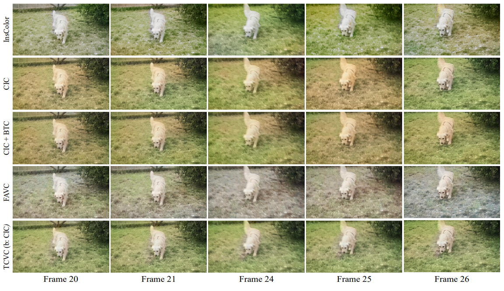
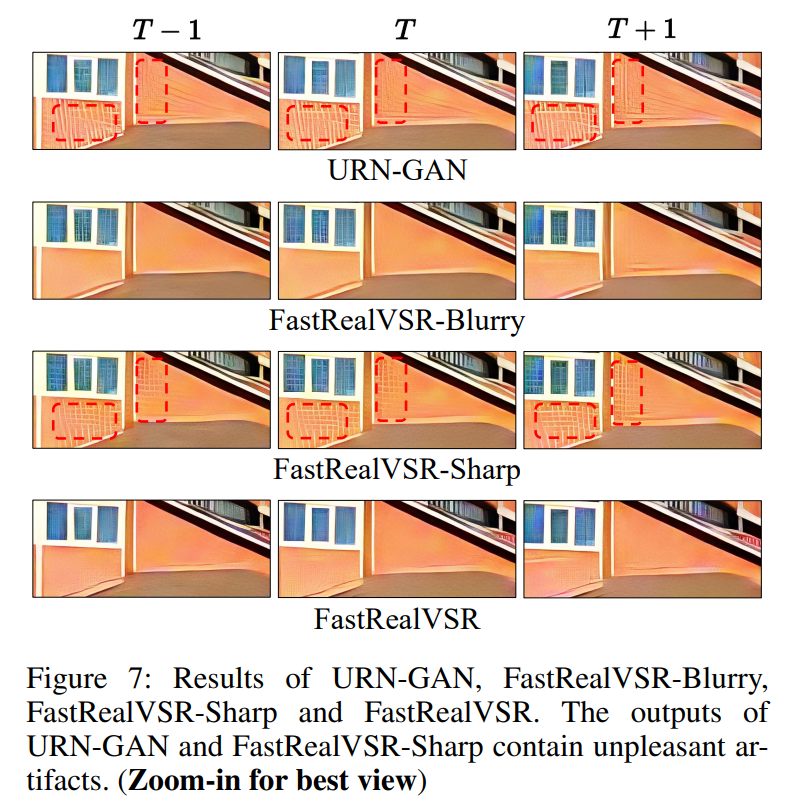
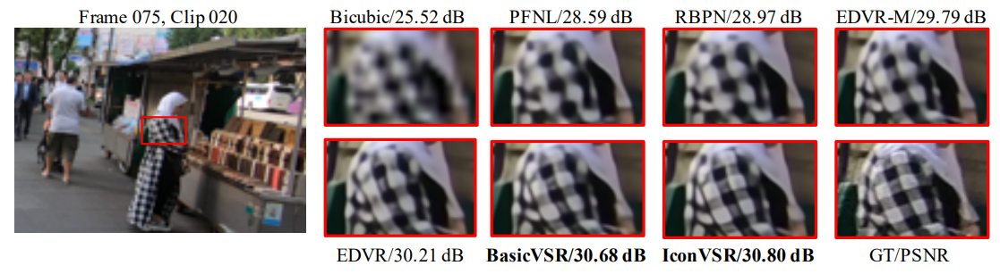
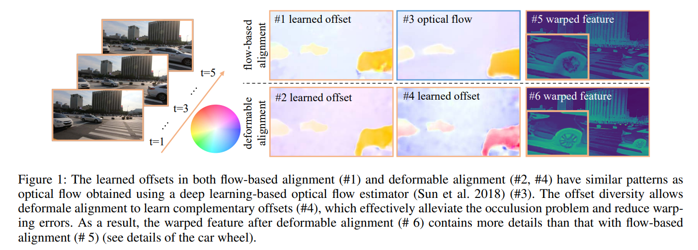
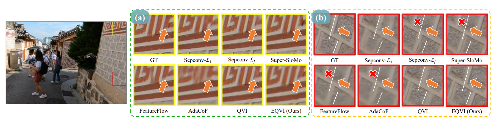
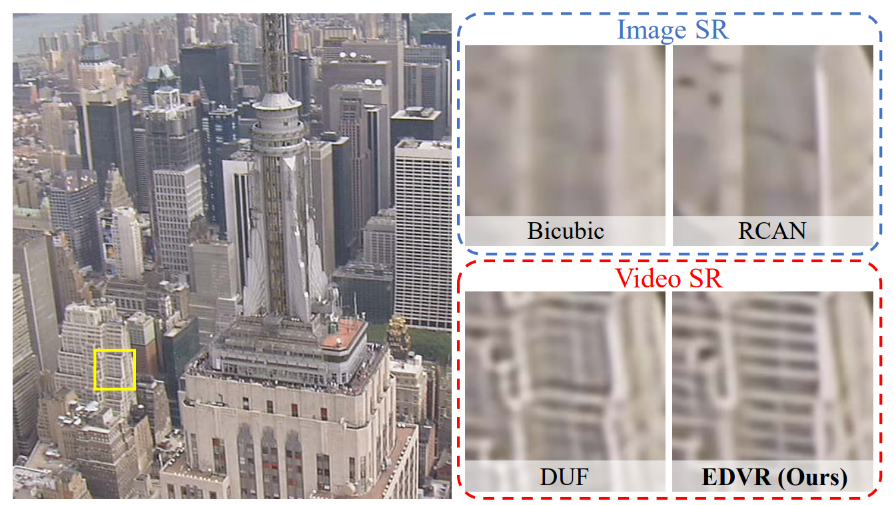

  
  

    <b>XPixel Homepage</b>
    
      <a href="http://xpixel.group/">
        <i>HOT</i>
      </a>
    
  

  
&nbsp;

English | [简体中文](README_zh-CN.md)

# Introduction

**X-Video-Processing** is dedicated to presenting the research efforts of XPixel in the realm of video processing. Video processing comprises several subtasks such as video denoising, deblurring, and super-resolution.

One of the significant challenges in video processing is the consideration of temporal information. Unlike image restoration, videos involve a temporal dimension that requires the algorithms to account for motion and changes over time.

# Full list

- [Temporally Consistent Video Colorization with Deep Feature Propagation and Self-regularization Learning](#TCVC)
- [Mitigating Artifacts in Real-World Video Super-Resolution Models](#mitigating)
- [BasicVSR: The Search for Essential Components in Video Super-Resolution and Beyond](#basicvsr)
- [Understanding Deformable Alignment in Video Super-Resolution](#understanding)
- [Enhanced Quadratic Video Interpolation](#enhanced)
- [EDVR: Video Restoration With Enhanced Deformable Convolutional Networks](#edvr)

# Papers

## Temporally Consistent Video Colorization with Deep Feature Propagation and Self-regularization Learning

Existing video colorization methods always suffer from severe flickering artifacts (temporal inconsistency) or unsatisfying colorization performance. We propose a novel temporally consistent video colorization framework (TCVC) to address this problem by jointly considering colorization and temporal consistency. Experiments demonstrate that our method can not only obtain visually pleasing colorized video, but also achieve clearly better temporal consistency than state-of-the-art methods.

  

- **Authors**: Yihao Liu, Hengyuan Zhao, Kelvin C.K. Chan, Xintao Wang, Chen Change Loy, Yu Qiao, Chao Dong
- Accepted at CVMJ'23
- **Links**: :scroll:[`paper`](https://arxiv.org/abs/2110.04562)

## Mitigating Artifacts in Real-World Video Super-Resolution Models

The recurrent structure is a prevalent framework for the task of video super-resolution, which models the temporal dependency between frames via hidden states. When applied to real-world scenarios with unknown and complex degradations, hidden states tend to contain unpleasant artifacts and propagate them to restored frames. We propose a Hidden State Attention (HSA) module to mitigate artifacts in real-world video super-resolution. Equipped with HSA, our proposed method, namely FastRealVSR, is able to achieve 2x speedup while obtaining better performance than Real-BasicVSR.

  

- **Authors**: Liangbin Xie, Xintao Wang, Honglun Zhang, Chao Dong, Ying Shan
- Accepted at AAAI'23
- **Links**: :scroll:[`paper`](https://arxiv.org/abs/2212.07339) :computer:[`code`](https://github.com/TencentARC/FastRealVSR)

## BasicVSR: The Search for Essential Components in Video Super-Resolution and Beyond

Complex designs are not uncommon in video super-resolution (VSR) approaches as they need to exploit the additional temporal dimension. In this study, we wish to untangle the knots and reconsider some most essential components for VSR. By reusing some existing components added with minimal redesigns, we show a succinct pipeline, BasicVSR, that achieves appealing improvements in terms of speed and restoration quality.

  

- **Authors**: Kelvin C.K. Chan, Xintao Wang, Ke Yu, Chao Dong, Chen Change Loy
- Accepted at CVPR'21
- **Links**: :scroll:[`paper`](https://arxiv.org/abs/2012.02181) :computer:[`code`](https://github.com/ckkelvinchan/BasicVSR-IconVSR)

## Understanding Deformable Alignment in Video Super-Resolution

Deformable convolution has recently shown compelling performance in aligning multiple frames. However, its underlying mechanism for alignment remains unclear. In this study, we show that deformable convolution can be decomposed into a combination of spatial warping and convolution and the increased diversity in deformable alignment significantly improves the quality of video super-resolution output. We further propose an offset-fidelity loss that guides the offset learning with optical flow. Experiments show that our loss successfully avoids the overflow of offsets and alleviates the instability problem of deformable alignment.

  

- **Authors**: Kelvin C.K. Chan, Xintao Wang, Ke Yu, Chao Dong, Chen Change Loy
- Accepted at AAAI'21
- **Links**: :scroll:[`paper`](https://arxiv.org/abs/2009.07265) :computer:[`code`](https://github.com/ckkelvinchan/offset-fidelity-loss)

## Enhanced Quadratic Video Interpolation

Recently, an algorithm named quadratic video interpolation (QVI) achieves appealing performance for video frame interpolation. However, its produced intermediate frames still contain some unsatisfactory artifacts, especially when large and complex motion occurs. In this work, we propose an enhanced quadratic video interpolation (EQVI) model, which won the first place in the AIM2020 Video Temporal Super-Resolution Challenge.

  

- **Authors**: Yihao Liu, Liangbin Xie, Li Siyao, Wenxiu Sun, Yu Qiao, Chao Dong
- Accepted at ECCVW'20
- **Links**: :scroll:[`paper`](https://arxiv.org/abs/2009.04642) :computer:[`code`](https://github.com/lyh-18/EQVI)

## EDVR: Video Restoration With Enhanced Deformable Convolutional Networks

A challenging benchmark named REDS for video restoration is released in the NTIRE19 Challenge. This benchmark challenges existing methods from two aspects: (1) how to align multiple frames given large motions, and (2) how to effectively fuse different frames with diverse motion and blur. In this work, we propose a novel Video Restoration framework with Enhanced Deformable networks, termed EDVR, to address these challenges. Our EDVR wins the champions and outperforms the second place by a large margin. EDVR also demonstrates superior performance to state-of-the-art published methods on video super-resolution and deblurring.

  

- **Authors**: Xintao Wang, Kelvin C.K. Chan, Ke Yu, Chao Dong, Chen Change Loy
- Accepted at CVPRW'19
- **Links**: :scroll:[`paper`](https://arxiv.org/abs/1905.02716) :computer:[`code`](https://github.com/xinntao/EDVR)

# License

This project is released under the [Apache 2.0 license](LICENSE).

# Projects in Open-XSource

- [X-Super Resolution](https://github.com/XPixelGroup/X-Super-Resolution): Algorithms in the realm of image super-resolution.
- [X-Image Processing](https://github.com/XPixelGroup/X-Image-Processing): Algorithms in the realm of image restoration and enhancement.
- [X-Video Processing](https://github.com/XPixelGroup/X-Video-Processing): Algorithms for processing videos.
- [X-Low level Interpretation](https://github.com/XPixelGroup/X-Low-level-Interpretation): Algorithms for interpreting the principle of neural networks in low-level vision field.
- [X-Evaluation and Benchmark](https://github.com/XPixelGroup/X-Evaluation-and-Benchmark): Datasets for training or evaluating state-of-the-art algorithms.
